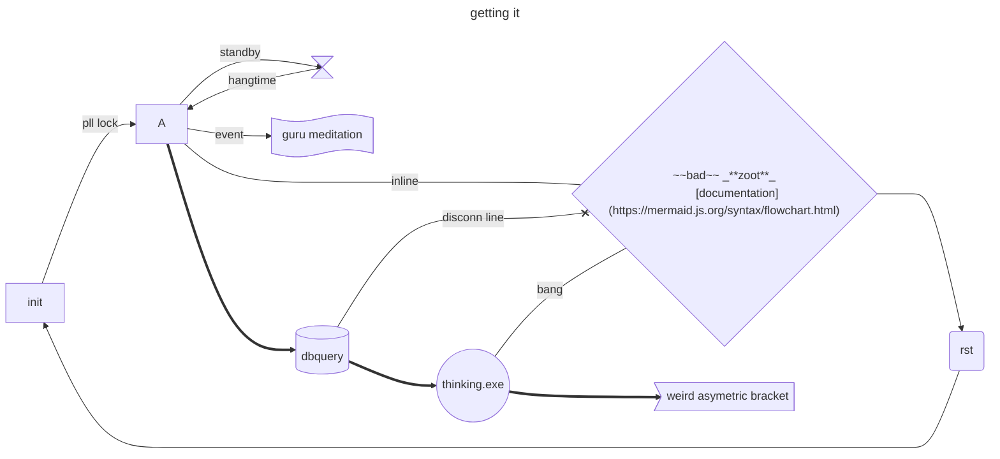

# cantrips
systems lore with dubious provenance

```mermaid

---
title: getting it
---

%%{init: {"flowchart": {"htmlLabels": false} }%%

flowchart LR
	init --> |"pll lock"| A
	A -->|standby| wait@{ shape: hourglass,  label:["ru meditation"] }
	A -->|event| log@{ shape: paper-tape, label:["guru meditation"]}
	wait --> |hangtime|A
	A --inline ---error{"~~bad~~ _**zoot**_
	[documentation](https://mermaid.js.org/syntax/flowchart.html)"}
	A ==> B[(dbquery)]
	B --x |disconn line| error
	B ==> C((thinking.exe))
	C --- |bang| error 
	C ==> done>weird asymetric bracket]
	error ---> spanking("rst")
	spanking --> init

```

