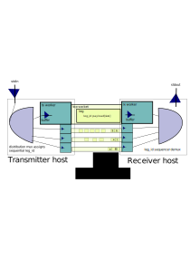

### viamillipede:

Viamillipede is client and server program built to improve network pipe transport using multiple TCP sessions.  It multiplexes a single network pipe into multiple TCP connectons and then terminates the connections into a pipe transparently on another host.  It is similar to the simplest mode of remote pipe transparency of Netcat.


#### Problems:

+ Single TCP connections have limitations on when they are expected to carry high throughput loads.
+ Poor mss window scaling. Congestion controls aggressively collapse mss when network conditions are not pristine.
+ Poor buffer interactions. "Shoe shining" when buffer sizing is not appropriate.
+ NewReno alternatives are not often acceptable.
+ Currently, flows are stuck on one physical interface.  This defeats the benefits of aggregation and multi-homed connections.

#### Goals and Features of viamillipede:

+ Provide:
     + Sufficent buffering for throughput.
     + Runtime SIGINFO inspection of traffic flow.`( parallelism, worker allocation, total throughput )`
     + Resilience against dropped TCP connections.`(*)`
+ Increase traffic throughput by:
     + Using parallel connections that each vie for survival against scaling window collapse.
     + Using multiple destination addresses with LACP/LAGG or separate Layer 2 adressing.
+ Intelligent Traffic Shaping:
     + Steer traffic to preferred interfaces.
     + Dynamically use faster destinations if preferred interfaces are clogged.
+ Make the compression/processing steps parallel. `(*)`
+ Architecture independence `(*)`

`(*)` denotes work in progress, because "hard * ugly > time"

```
TOP:
	scatter gather transport via multiple workers
	feet  are the work blocks
	start workers
	worker states
		idle
		working
	the window is the feet in flight
		window:
			foot (footid)
			stream start =  footid * footsize
			stream end =  (footid + 1) * footsize
			window [firstfoot, lastfoot]  ... heap? sorted for min foot out?

	sequence recieved feet to receate stream in order
	supervise the results relaibly.
	retrnsmit failed feet
	maximize throughput vs window vs latency product

	Retry broken transport works
```
